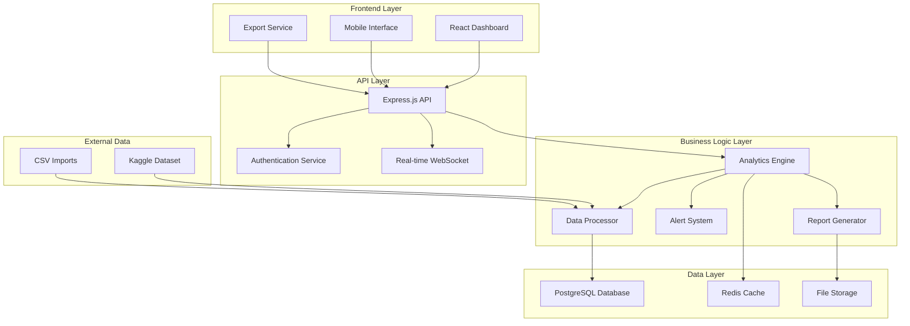
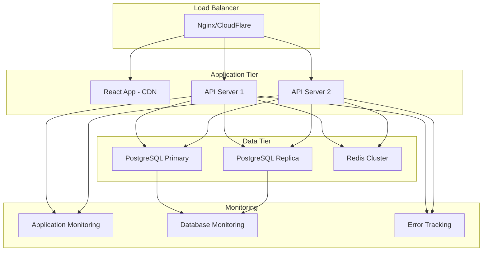

# CoffeeBiz Analytics - Design Document

## Overview

CoffeeBiz Analytics is a web-based business intelligence dashboard built using modern web technologies. The system follows a modular architecture with a React frontend, Node.js/Express backend, and PostgreSQL database. The design emphasizes performance, usability, and scalability while maintaining simplicity for non-technical users.

### Key Design Principles
- **User-Centric Design**: Intuitive interface requiring minimal training
- **Performance First**: Sub-3-second load times and real-time updates
- **Mobile-First**: Responsive design for on-the-go access
- **Data-Driven**: Transform raw sales data into actionable insights
- **Modular Architecture**: Separate concerns for maintainability

## Architecture

### System Architecture Overview



### Technology Stack
- **Frontend**: React 18, TypeScript, Tailwind CSS, Chart.js/D3.js
- **Backend**: Node.js, Express.js, TypeScript
- **Database**: PostgreSQL with Redis for caching
- **Real-time**: WebSocket for live updates
- **Authentication**: JWT-based authentication
- **Deployment**: Docker containers, cloud-ready

## Components and Interfaces

### Frontend Components

#### 1. Dashboard Layout Component
```typescript
interface DashboardLayoutProps {
  user: User;
  activeModule: ModuleType;
  onModuleChange: (module: ModuleType) => void;
}
```

#### 2. Revenue Analytics Module
```typescript
interface RevenueAnalyticsProps {
  dateRange: DateRange;
  viewType: 'daily' | 'weekly' | 'monthly' | 'yearly';
  comparisonEnabled: boolean;
}

interface RevenueMetrics {
  totalRevenue: number;
  growthRate: number;
  avgTransactionValue: number;
  revenuePerCustomer: number;
  profitMargins: CategoryMargin[];
}
```

#### 3. Product Performance Module
```typescript
interface ProductPerformanceProps {
  categoryFilter: string[];
  sortBy: 'revenue' | 'units' | 'margin';
}

interface ProductMetrics {
  topProducts: Product[];
  bottomProducts: Product[];
  categoryPerformance: CategoryStats[];
  sizePreferences: SizeStats[];
  addonPerformance: AddonStats[];
  seasonalTrends: SeasonalData[];
}
```

#### 4. Peak Hours Analysis Module
```typescript
interface PeakHoursProps {
  selectedDate: Date;
  viewType: 'hourly' | 'daily' | 'weekly';
}

interface TrafficMetrics {
  hourlyVolume: HourlyData[];
  dailyPatterns: DailyPattern[];
  weeklyComparison: WeeklyStats[];
  staffingRecommendations: StaffingPlan[];
  queueAnalysis: QueueStats[];
}
```

### Backend API Interfaces

#### 1. Analytics Service
```typescript
interface AnalyticsService {
  getRevenueMetrics(params: RevenueQueryParams): Promise<RevenueMetrics>;
  getProductPerformance(params: ProductQueryParams): Promise<ProductMetrics>;
  getTrafficAnalysis(params: TrafficQueryParams): Promise<TrafficMetrics>;
  getCustomerInsights(params: CustomerQueryParams): Promise<CustomerMetrics>;
  getInventoryAnalysis(params: InventoryQueryParams): Promise<InventoryMetrics>;
}
```

#### 2. Data Processing Service
```typescript
interface DataProcessor {
  importKaggleDataset(filePath: string): Promise<ImportResult>;
  processTransactionData(data: RawTransaction[]): Promise<ProcessedTransaction[]>;
  calculateMetrics(transactions: ProcessedTransaction[]): Promise<CalculatedMetrics>;
  updateRealTimeMetrics(newTransaction: Transaction): Promise<void>;
}
```

#### 3. Report Generation Service
```typescript
interface ReportGenerator {
  generatePDFReport(params: ReportParams): Promise<Buffer>;
  generateExcelReport(params: ReportParams): Promise<Buffer>;
  scheduleReport(params: ScheduleParams): Promise<ScheduleResult>;
}
```

## Data Models

### Core Data Models

#### Transaction Model
```typescript
interface Transaction {
  id: string;
  timestamp: Date;
  customerId?: string;
  items: TransactionItem[];
  totalAmount: number;
  paymentMethod: PaymentMethod;
  location?: string;
  staffMember?: string;
}

interface TransactionItem {
  productId: string;
  productName: string;
  category: ProductCategory;
  size: ProductSize;
  quantity: number;
  unitPrice: number;
  addons: Addon[];
  cost: number;
}
```

#### Product Model
```typescript
interface Product {
  id: string;
  name: string;
  category: ProductCategory;
  sizes: ProductSize[];
  basePrice: number;
  cost: number;
  availableAddons: string[];
  seasonal: boolean;
  active: boolean;
}

enum ProductCategory {
  ESPRESSO = 'espresso',
  LATTE = 'latte',
  CAPPUCCINO = 'cappuccino',
  PASTRY = 'pastry',
  SANDWICH = 'sandwich',
  OTHER = 'other'
}
```

#### Customer Model
```typescript
interface Customer {
  id: string;
  email?: string;
  phone?: string;
  loyaltyMember: boolean;
  registrationDate: Date;
  totalSpent: number;
  visitCount: number;
  lastVisit: Date;
  preferences: CustomerPreferences;
}
```

### Database Schema Design

#### Tables Structure
```sql
-- Transactions table
CREATE TABLE transactions (
  id UUID PRIMARY KEY,
  timestamp TIMESTAMP NOT NULL,
  customer_id UUID REFERENCES customers(id),
  total_amount DECIMAL(10,2) NOT NULL,
  payment_method VARCHAR(50),
  location VARCHAR(100),
  staff_member VARCHAR(100),
  created_at TIMESTAMP DEFAULT NOW()
);

-- Transaction items table
CREATE TABLE transaction_items (
  id UUID PRIMARY KEY,
  transaction_id UUID REFERENCES transactions(id),
  product_id UUID REFERENCES products(id),
  quantity INTEGER NOT NULL,
  unit_price DECIMAL(10,2) NOT NULL,
  size VARCHAR(20),
  addons JSONB
);

-- Products table
CREATE TABLE products (
  id UUID PRIMARY KEY,
  name VARCHAR(255) NOT NULL,
  category VARCHAR(50) NOT NULL,
  base_price DECIMAL(10,2) NOT NULL,
  cost DECIMAL(10,2) NOT NULL,
  seasonal BOOLEAN DEFAULT FALSE,
  active BOOLEAN DEFAULT TRUE
);
```

## Error Handling

### Error Categories and Responses

#### 1. Data Import Errors
```typescript
interface ImportError {
  type: 'INVALID_FORMAT' | 'MISSING_COLUMNS' | 'DATA_VALIDATION';
  message: string;
  line?: number;
  column?: string;
  suggestions: string[];
}
```

#### 2. API Error Responses
```typescript
interface APIError {
  code: string;
  message: string;
  details?: any;
  timestamp: Date;
  requestId: string;
}

// Standard error codes
enum ErrorCodes {
  INVALID_DATE_RANGE = 'INVALID_DATE_RANGE',
  INSUFFICIENT_DATA = 'INSUFFICIENT_DATA',
  CALCULATION_ERROR = 'CALCULATION_ERROR',
  EXPORT_FAILED = 'EXPORT_FAILED'
}
```

#### 3. Frontend Error Handling
- Graceful degradation for missing data
- User-friendly error messages
- Retry mechanisms for failed requests
- Offline mode indicators
- Data validation before submission

### Error Recovery Strategies
- Automatic retry for transient failures
- Fallback to cached data when real-time fails
- Progressive data loading for large datasets
- User notification system for critical errors

## Testing Strategy

### Testing Pyramid

#### 1. Unit Tests (70%)
- **Analytics calculations**: Revenue, profit margins, growth rates
- **Data processing functions**: Import validation, transformation
- **Utility functions**: Date handling, formatting, validation
- **Component logic**: State management, event handling

#### 2. Integration Tests (20%)
- **API endpoints**: Request/response validation
- **Database operations**: CRUD operations, complex queries
- **Data pipeline**: End-to-end data processing
- **Authentication flow**: Login, token validation

#### 3. End-to-End Tests (10%)
- **Critical user journeys**: Dashboard navigation, report generation
- **Mobile responsiveness**: Touch interactions, responsive layouts
- **Performance benchmarks**: Load times, real-time updates
- **Cross-browser compatibility**: Chrome, Firefox, Safari, Edge

### Test Data Strategy
- **Synthetic data generation**: Realistic coffee shop transaction patterns
- **Kaggle dataset subset**: Representative sample for testing
- **Edge case scenarios**: Empty data, extreme values, invalid inputs
- **Performance test data**: Large datasets for load testing

### Testing Tools
- **Unit Testing**: Jest, React Testing Library
- **Integration Testing**: Supertest, TestContainers
- **E2E Testing**: Playwright or Cypress
- **Performance Testing**: Lighthouse, WebPageTest
- **Load Testing**: Artillery or k6

## Performance Optimization

### Frontend Performance
- **Code splitting**: Lazy loading of dashboard modules
- **Caching strategy**: Browser caching, service worker
- **Bundle optimization**: Tree shaking, minification
- **Image optimization**: WebP format, lazy loading
- **Virtual scrolling**: For large data tables

### Backend Performance
- **Database optimization**: Proper indexing, query optimization
- **Caching layer**: Redis for frequently accessed data
- **Connection pooling**: Efficient database connections
- **Background processing**: Queue system for heavy calculations
- **CDN integration**: Static asset delivery

### Real-time Updates
- **WebSocket optimization**: Selective updates, connection management
- **Data streaming**: Incremental updates vs full refresh
- **Throttling**: Rate limiting for real-time events
- **Offline support**: Service worker for offline functionality

## Security Considerations

### Authentication & Authorization
- JWT-based authentication with refresh tokens
- Role-based access control (owner, manager, staff)
- Session management and timeout handling
- Multi-factor authentication support

### Data Protection
- Input validation and sanitization
- SQL injection prevention
- XSS protection
- CSRF protection
- Data encryption at rest and in transit

### API Security
- Rate limiting and throttling
- API key management
- Request/response logging
- CORS configuration
- Security headers implementation

## Deployment Architecture

### Production Environment


### Scalability Considerations
- Horizontal scaling of API servers
- Database read replicas for analytics queries
- Redis clustering for cache scalability
- CDN for global content delivery
- Auto-scaling based on traffic patterns

This design provides a solid foundation for building CoffeeBiz Analytics while meeting all the performance, usability, and functionality requirements outlined in the specification.